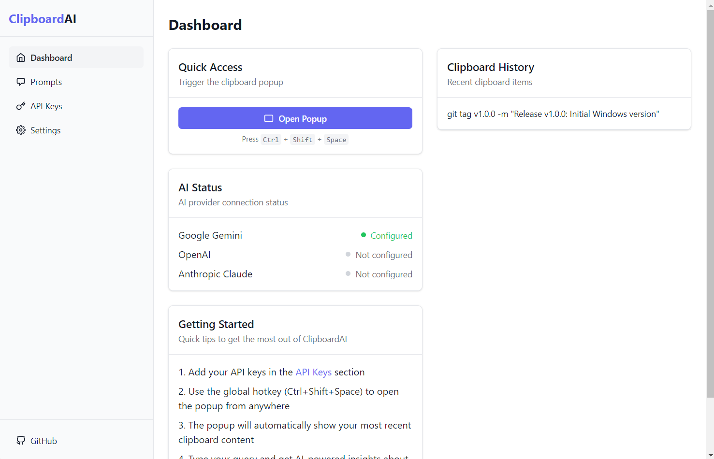
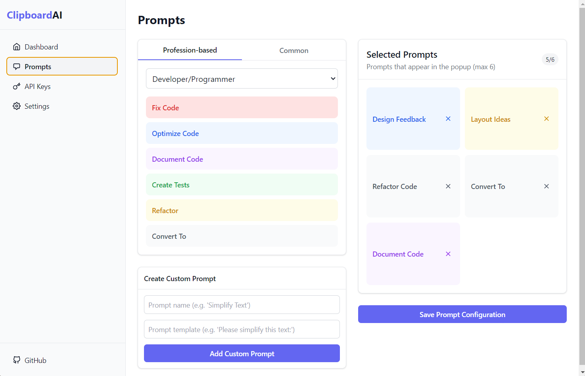
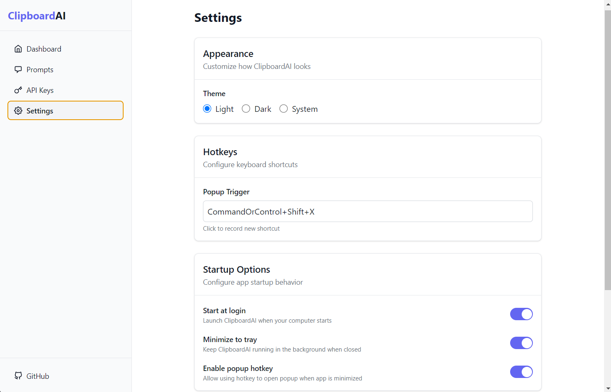
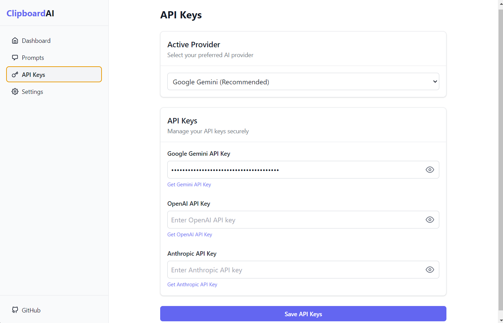
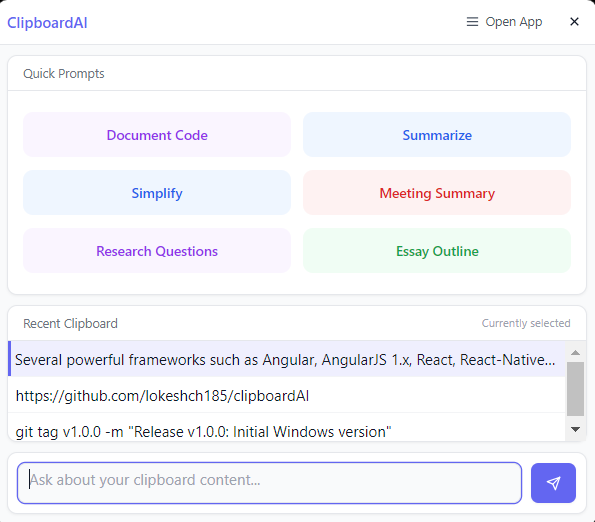

# ClipboardAI

ClipboardAI is an AI-powered clipboard assistant that works with multiple LLM providers to help you process text from your clipboard quickly and efficiently.



## Features

- **Multiple AI Providers**: Support for Google Gemini, OpenAI, and Anthropic Claude
- **Quick Access**: Popup window with customizable keyboard shortcuts
- **Prompt Templates**: Create and save reusable prompt templates
- **Clipboard History**: Access your recent clipboard items
- **System Integration**: Runs in your system tray for easy access
- **Dark Mode**: Supports both light and dark themes
- **Secure**: Your API keys are stored encrypted on your local device

## The Main Application

<div align="center">
  
  
</div>

<div align="center">
  
  
</div>

## Hotkey Popup

<div align="center">
  
</div>


## Installation

### Windows
Download the latest installer from the [Releases](https://github.com/lokeshch185/clipboardAI/releases) page.

### macOS
Download the latest DMG from the [Releases](https://github.com/lokeshch185/clipboardAI/releases) page.

### Linux
Download the latest AppImage from the [Releases](https://github.com/lokeshch185/clipboardAI/releases) page.

## Getting Started

1. Install ClipboardAI
2. Get API keys from your preferred AI provider(s):
   - [Google Gemini API Key](https://makersuite.google.com/app/apikey)
   - [OpenAI API Key](https://platform.openai.com/api-keys)
   - [Anthropic API Key](https://console.anthropic.com/settings/keys)
3. Configure your API keys in the app settings
4. Use the default keyboard shortcut (`Ctrl+Shift+Space` or `Cmd+Shift+Space` on macOS) to open the popup

## Using ClipboardAI

### Basic Usage
1. Copy any text to your clipboard
2. Press the keyboard shortcut (`Ctrl+Shift+Space` by default)
3. Select a prompt template or type your custom prompt
4. Get AI-processed result
5. Copy the result back to your clipboard with one click

### Customizing Prompts
Create your own prompt templates in the Settings tab:
1. Open the main application
2. Go to Settings
3. Add custom prompt templates with different colors

## Development

### Prerequisites
- Node.js 16+
- npm or yarn

### Setup
```bash
# Clone the repository
git clone https://github.com/lokeshch185/clipboardAI.git
cd clipboardAI

# Install dependencies
npm install

# Start the application
npm start

# Build for production
npm run build
```

## Privacy & Security

- ClipboardAI is a desktop application that runs locally on your device
- Your API keys are encrypted and stored only on your local machine
- No clipboard data is sent anywhere except to the AI provider you've configured
- The app does not collect any usage data or analytics

## License

This project is licensed under the MIT License - see the [LICENSE](LICENSE) file for details.

## Contributing

Contributions are welcome! Please feel free to submit a Pull Request.

## Credits

- Created by [Lokesh Chaudhari](https://github.com/lokeshch185)
- Built with [Electron](https://www.electronjs.org/)

---

**Note**: You need to provide your own API keys to use this application. The developer is not responsible for any charges incurred from usage of the AI APIs. 